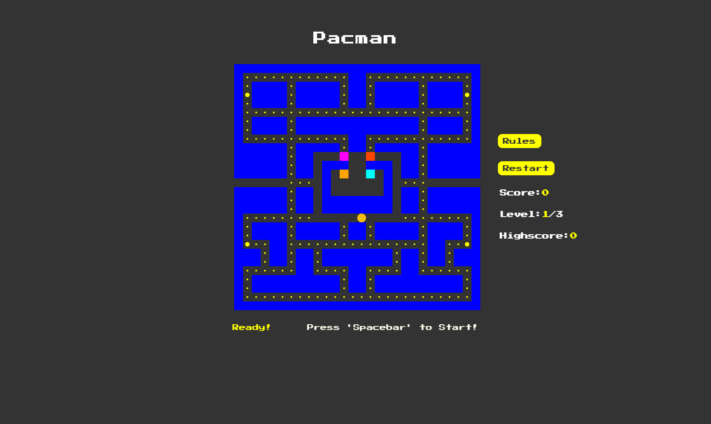

# Pacman

Pacman is a web-based game inspired by the classic arcade game of the same name. The objective is to guide Pac-Man through a maze, eating all the pellets while avoiding ghosts.[Live Demo](https://pacman-dutta.netlify.app/)

## Tech Stack

- HTML
- CSS
- JavaScript

## Features

- Control Pac-Man using the arrow keys (←↑→↓).
- Eat all white pellets to progress through the game.
- Larger, flashing pellets make ghosts vulnerable. Pac-Man can eat ghosts for extra points while they're vulnerable.
- Avoid being caught by ghosts (Blinky, Pinky, Inky, Clyde). Ghosts capture Pac-Man upon contact.
- Use warp tunnels for quick traversal across the maze.
- Points awarded for eating pellets and ghosts.
- Difficulty levels increase as Pac-Man consumes pellets. Ghosts' speed increases with each difficulty level.
- Game ends when Pac-Man loses a life.

## Learning

- Managed game state and interactions using event listeners and DOM manipulation.
- Calculated scores, managed game difficulty, and implemented game mechanics such as pellet consumption, ghost movement, and level progression.
- Created the layout using an array and implemented a ghost auto-moving algorithm.

## Improvement

- Enhance game responsiveness for smoother gameplay across various devices.
- Implement additional features such as a fruit bonus and additional levels to increase player engagement.
- Develop a new algorithm for more practical movement of ghosts. The algorithm should enable ghosts to stalk Pac-Man when they are close.
- Replace basic shapes with actual Pac-Man graphics to represent ghosts and Pac-Man for a more immersive gaming experience.
